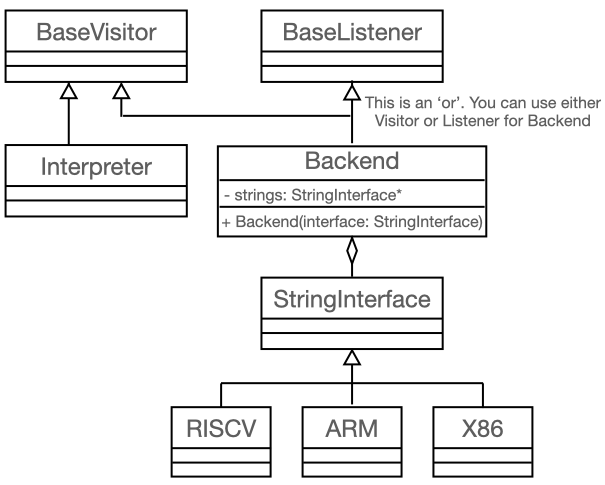

SCalc
=====

The goal of this assignment is to implement a compiler for a simple
imperative language called *SCalc*. This compiler will directly generate
code for the following three backends:

-  *x86* assembly

-  *RISC-V* assembly

-  *ARM* assembly

You must also create an *interpreter* for *SCalc*

For the interpreter you will be computing the value of the expressions
as you traverse the tree. However, when generating assembly code for
each of the backends **you are not allowed to perform any computations
in the compiler**. You must create assembly code to perform all of the
computations that appear in the input file.

| *RISC-V* assembly will be run using the RISC-V Assembler and Runtime Simulator, *RARS*
| *x86* assembly will be assembled using the nasm assembler and run
  natively.
| *ARM* assembly will be compiled using the *ARM* toolchain (assembler
  ``arm-none-eabi-as``, linker ``arm-none-eabi-gcc``) and then run using
  an *ARM* simulator (*qemu-arm*).

Your compiler will produce the assembly text files, not binaries. **You
must generate your assembly
using**\ `inja <https://github.com/pantor/inja>`__. Inja is a string
template engine which allows you to make use of formatted strings. Its
syntax is similar to *Python*\ ’s jinja. You won’t need any advanced
features to complete this assignment.

It is recommended to follow a pattern of classes matching the following
UML diagram (structure only, names should be reasonably changed):

|expectedForm|

Note that you must use the visitor pattern for the interpreter as it is
impossible to revisit nodes during a loop when using the listener
pattern.

Beyond these constraints you are allowed to use any internal
representation that you wish, as well as emit any code that you wish, as
long as the output is correct.

*SCalc* has integer variables, conditionals, loops, prints, and various
integer expressions.

.. toctree::
   :hidden:

   self

.. toctree::
   :maxdepth: 3
   :caption: Language Specification
   :numbered:

   spec/keywords
   spec/booleans
   spec/integers
   spec/identifiers
   spec/expressions
   spec/statements
   spec/comments

.. toctree::
   :maxdepth: 2
   :caption: Implementation

   impl/backends
   impl/input
   impl/output
   impl/assertions
   impl/clarifications
   impl/deliverables
   impl/tips_hints

.. toctree::
   :maxdepth: 2
   :caption: Getting Started
   
   start/inja

